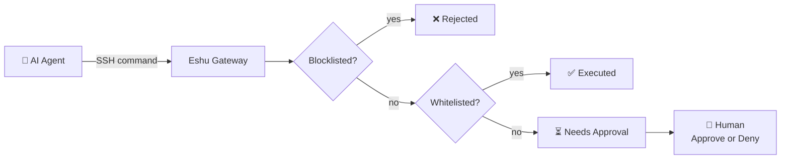
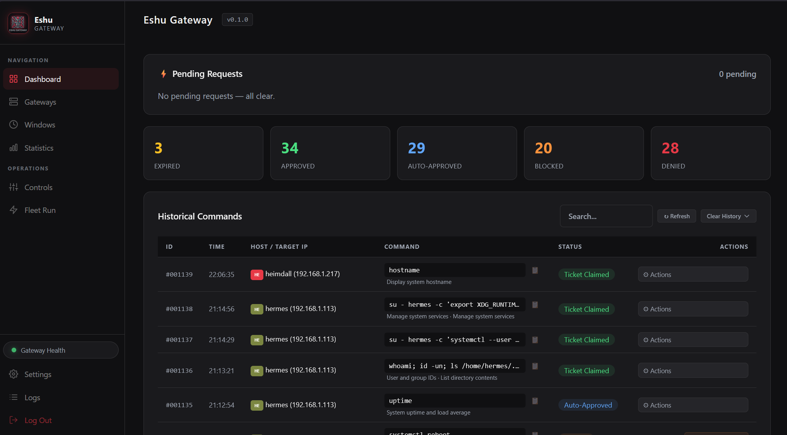
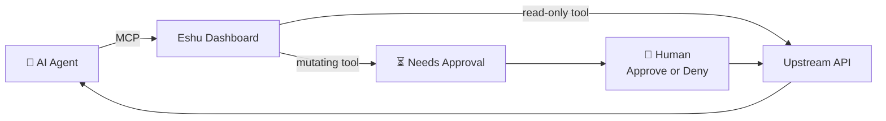

<p align="center">
  
</p>

<p align="center">
  <a href="https://github.com/fruitsky/eshu-gateway"></a>
  <a href="LICENSE"></a>
  <a href="#"></a>
  <a href="#"></a>
</p>

# Eshu Gateway

**Human-in-the-loop access for AI agents.** Eshu sits between your AI agent and
your infrastructure across **two surfaces**, both behind the same audit +
approval gate:

- **SSH commands** — intercepted through a locked-down `eshu-gateway` user, run
  through a multi-layer policy engine, and — if no rule matches — routed to
  Just-In-Time approval from a human operator. No VPN, no open ports: just SSH +
  a polling control plane.
- **Homelab APIs over MCP** — the same agent can call Proxmox, Omada, Home
  Assistant, Pulse, Jellyfin, Pi-hole, Sonarr, Radarr and Prowlarr through
  Eshu's MCP server, with server-side credential vaulting, per-call audit, and
  approval-gated mutations.

> Eshu is a vibe-coded hobby project built for homelabs and non-production
> infrastructure. It's a practical tool for giving AI agents supervised SSH
> access and supervised API access to your homelab without handing over the
> keys.



---

## Screenshot

<p align="center">
  
</p>

---

## Features

- **Multi-Stage Policy Engine** — hardcoded catastrophic blocklist → blacklist → exact/regex whitelist → feature scripts → JIT human approval
- **Integrations & MCP** — expose your homelab APIs to agents over MCP: server-side credential vaulting, per-call audit, and approval-gated mutations. Proxmox, Omada, Home Assistant, Pulse, Jellyfin, Pi-hole, Sonarr, Radarr, Prowlarr, plus generic read/write for any other REST API
- **Approved Windows** — pre-approve recurring or single-use time windows for specific commands; agents can request them via API and the operator approves
- **Just-In-Time Approval** — anything not explicitly allowed lands in the operator's queue for approve/deny, with desktop notifications
- **Zero-Trust Gateways** — a per-gateway strictness tier: *nothing* auto-runs; every command needs operator approval
- **Emergency Freeze** — one button makes every gateway reject all commands until unfrozen (global circuit breaker)
- **Fleet Run (Ansible-lite)** — queue commands and dispatch them to a subset of gateways with per-gateway results
- **Live Dashboard** — real-time SPA: request queue, gateway health, policy editor, audit log, enrollment, statistics
- **Self-Syncing Gateways** — nodes pull policies every 30s via a systemd poller; no inbound connectivity needed
- **One-Liner Enrollment** — `curl | bash` deploys a gateway in seconds with SSH keys embedded

---

## Integrations & MCP

Eshu doesn't just gate SSH — it's also an **API gateway for your homelab**. Add
an integration (name, base URL, credentials), seed its curated tool catalog, and
your agent calls the upstream API **through Eshu** instead of holding the raw
keys. Same trust model as the SSH side: reads auto-run, **mutations need
operator approval**.



**Supported kinds** — Proxmox · Omada · Home Assistant · Pulse · Jellyfin ·
Pi-hole · Sonarr · Radarr · Prowlarr. Any other integration gets a **generic
`read`/`write`** tool floor (including `HEAD` metadata reads) for arbitrary REST
APIs.

- **Credentials never leave Eshu.** Secrets live in the dashboard DB, are masked
  in the UI (last-4 suffix), scrubbed from every response and error before the
  agent sees them, and stripped from approval rows after resolve.
- **Human-in-the-loop, same as SSH.** Read-only tools auto-run and are audited;
  mutating tools land in a **Pending API Approvals** queue until the operator
  approves or denies — the agent polls for the outcome.
- **Agent tokens.** Long-lived bearer tokens for `/mcp`; only a SHA-256 hash is
  stored, and a DNS-rebinding allowlist controls which `Host` headers are
  accepted.

Full setup guide (agent tokens, adding integrations, MCP Access, Hermes
connect): **[docs/INTEGRATIONS.md](docs/INTEGRATIONS.md)**.

---

## Quick Start

### 1. Run the dashboard

```bash
git clone https://github.com/fruitsky/eshu-gateway.git ~/eshu-gateway
cd ~/eshu-gateway
sudo bash bootstrap.sh
```

The bootstrap script creates a Python venv, installs dependencies, writes a
systemd unit, and starts the dashboard on port **8000**. On first launch you'll
be prompted to set a dashboard password (required — it protects all sensitive
endpoints). Change it anytime in Settings → Dashboard Password, or via
`python3 dashboard/set_password.py` on the dashboard host.

### 2. Create and register the agent's SSH key

Enrollment is driven by **one SSH key pair**. The dashboard stores only the
**public** key; the matching **private** key stays with the agent and never
leaves its host.

| Key | Who holds the private key | What it does |
|-----|---------------------------|--------------|
| **Eshu Gateway key** | Your AI agent (e.g. Hermes) | The agent logs in as `eshu-gateway@host`. SSH is locked to the gateway script, so **every command runs through the policy gate**. |

```bash
# Create the key pair (run on the machine that will hold the private key)
ssh-keygen -t ed25519 -f ~/.ssh/eshu_gateway -C "agent@eshu"
```

Now paste the **public key** (`~/.ssh/eshu_gateway.pub`) into the dashboard
(**Gateways → Gateway Enrollment → SSH Public Keys**). Only the `.pub` file
goes on the dashboard — the private key stays with the agent.

### 3. Enroll a gateway

Generate a one-time enrollment token in the dashboard, then run the one-liner
**on the target host**:

```bash
curl -s "http://<dashboard-ip>:8000/api/enroll?token=<token>" | bash
```

> The URL is quoted because zsh (TrueNAS SCALE's shell) glob-expands an
> unquoted `?` and aborts with "no matches found". The dashboard's copy button
> emits the quoted form; if you hand-type it, keep the quotes.

That's it. The installer writes the agent key to `eshu-gateway`'s
`authorized_keys` with a forced-command wrapper (so it can only run the policy
engine), registers the gateway, and starts the poller. It appears on the
dashboard within 30 seconds.

### 4. Connect your agent

The agent uses its private key to SSH in as `eshu-gateway` on any enrolled host:

```bash
ssh -i ~/.ssh/eshu_gateway eshu-gateway@<host> "docker ps"
```

Make sure the private key file (e.g. `~/.ssh/eshu_gateway`) is installed on the
**agent's machine**, owned by the agent's user, with `chmod 600`. It never goes
on the dashboard or on the gateways — only the `.pub` file does (step 2).

A convenient `~/.ssh/config` entry:

```
Host eshu-*
    User eshu-gateway
    IdentityFile ~/.ssh/eshu_gateway
    IdentitiesOnly yes
```

The first non-allowlisted command will create a JIT request on the dashboard —
approve or deny it from there.

### 5. (Optional) Connect your APIs over MCP

Give the agent the same supervised access to your homelab APIs:

```bash
hermes mcp add eshu-mcp --url https://<dashboard>/mcp --auth header
# at the "API key / Bearer token" prompt, paste the RAW agent token (no "Bearer " prefix)
```

Add an integration in **Integrations → Add Integration** (e.g. Proxmox, Omada,
Home Assistant), hit **Seed** to load its curated tools, and enable the subset
you want. Read-only tools run immediately; mutating tools queue for your
approval in **Integrations → Pending API Approvals**. See
[docs/INTEGRATIONS.md](docs/INTEGRATIONS.md) for the full walkthrough.

### Supported platforms & installation

Eshu Gateway installs a systemd service, policy files under `/etc`, a sudoers
rule, and scripts in `/usr/local/bin` — so it requires **root + systemd**:

| Platform | How to install |
|----------|----------------|
| Debian/Ubuntu & standard Linux | Run the one-liner as root, or prefix it with sudo: `curl -s … | sudo bash` |
| **TrueNAS SCALE** (shell console) | *Support varies:* run the one-liner **directly** (the shell is already root and there is **no `sudo` binary**), and keep the URL **quoted** (its shell is `zsh`). **Newer releases are immutable** — read-only `/usr` and `/opt` — so the gateway can't install there; releases with a writable `/usr/local` work. |
| Home Assistant OS & other rootless/immutable systems | **Not supported** — no root or systemd access; the installer refuses with a clear message. |

If you run the one-liner as a non-root user, the installer prints the correct
command for your system instead of failing silently.

### Hardening note

Eshu is designed for a **private network**. The dashboard and the enrollment
one-liner speak plain HTTP, so beyond your homelab you should put the dashboard
behind a reverse proxy with TLS and/or a firewall. For extra lock-down, the
agent key accepts an optional source-IP restriction — set `ALLOWED_SSH_FROM`
(e.g. `192.168.1.50`) when enrolling so the agent can only connect from that
address.

---

## Security & threat model

Eshu is a **human-in-the-loop command gateway**, not a sandbox. It gives an AI
agent (or a human operator) supervised SSH access to a fleet and enforces a
policy + approval gate around it. Read this before trusting it with anything
important.

**What it protects against**
- **Blind/runaway agents** — no command runs without a policy match or explicit
  operator approval (JIT). Destructive patterns are blocked before anything
  else (`rm -rf`, `mkfs`, `dd`, firewall flushes, power control, …).
- **Wrong-host mistakes** — each gateway's SSH entry point is a locked-down
  `eshu-gateway` user whose forced command *is* the policy engine, so an agent
  SSHing into a host can only reach that host's gated command path.
- **Approval fatigue / silent escalation** — every request is audited; the
  emergency freeze is an absolute global circuit breaker; Zero-Trust gateways
  take "every command needs my approval" to the extreme.

**Honest limitations (read these)**
- **Designed for a single trusted operator** on a private network — there is
  **no multi-user RBAC**. Anyone with the dashboard password (or a registered
  gateway) is an operator.
- **Operator judgment is the control.** JIT is a human approval gate, not a
  capability sandbox: an approved command runs with the gateway user's
  privileges (root via sudoers). Approve deliberately.
- **Not formally audited or fuzz-tested.** The policy matchers are regex-based
  and best-effort; they are not a hard security boundary. A determined
  attacker who already has an agent shell can often find a way around static
  patterns.
- **LAN-scale.** It is designed for a home-lab / small-fleet network, not as an
  internet-facing product. Put the dashboard behind auth (it has a password +
  session cookie) and don't expose the API directly to the internet.
- The static command-string screens (blocklists, risk hints) are
  **best-effort**, not a guarantee — treat them as ergonomic guardrails, with
  JIT as the real gate.

---

## Documentation

| Doc | What's in it |
|-----|--------------|
| [docs/AGENT_MANUAL.md](docs/AGENT_MANUAL.md) | The AI agent's manual: JIT requests, polling approvals, Approved Windows workflow |
| [docs/API.md](docs/API.md) | Full API reference |
| [docs/INTEGRATIONS.md](docs/INTEGRATIONS.md) | Integrations & MCP setup: expose homelab APIs to agents with audit + approval |
| [docs/ARCHITECTURE.md](docs/ARCHITECTURE.md) | Deployment layout, policy pipeline, gateway lifecycle |
| [docs/DEV_GUIDE.md](docs/DEV_GUIDE.md) | Developer workflow, feature flags, tests, file structure |
| [CHANGELOG.md](CHANGELOG.md) | Version history with dates and details |
| [SECURITY.md](SECURITY.md) | How to report a vulnerability |

---

## License

MIT — see [LICENSE](LICENSE) for details.
