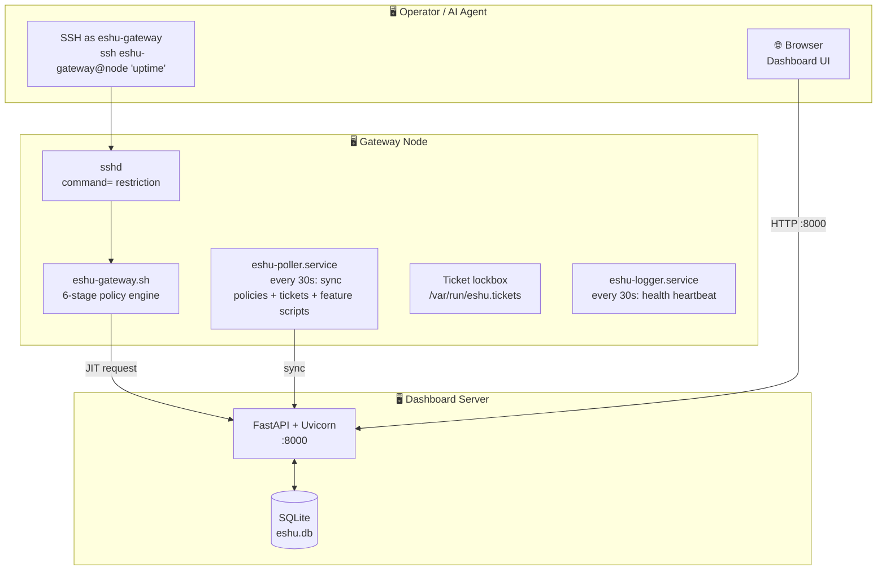
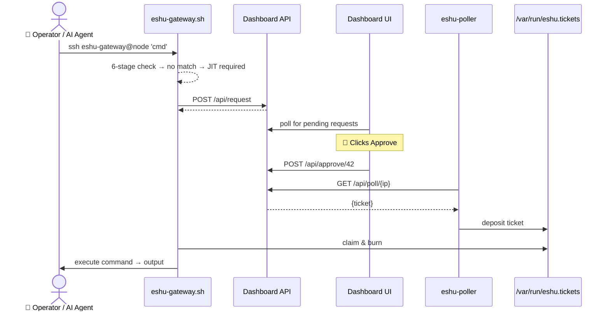

# Architecture

This page holds the technical reference for Eshu Gateway — the deployment
layout, the policy pipeline, and the gateway lifecycle. For setup instructions
see the [README](../README.md); for the developer workflow see
[DEV_GUIDE.md](DEV_GUIDE.md).

## Deployment layout

JIT Approval Sequence Diagram

## Policy Pipeline

Every command passes through these stages in order:

| Stage | Rule Set | Match → Action |
|:-----:|----------|---------------|
| **0** | **Emergency Freeze** (global circuit breaker) — when the operator freezes the fleet, every gateway rejects all commands until unfrozen | **FATAL — rejected while frozen** |
| **1** | Hardcoded catastrophic blocklist (`rm -rf`, `mkfs`, `dd`, `iptables -F`, `reboot`, Eshu self-access, etc.) | **FATAL — blocked permanently** |
| **2** | Dashboard-managed blacklist (`/etc/eshu-rblack.txt`) | **Blocked** |
| **3** | Exact whitelist (`/etc/eshu-exact.txt`) | **Auto-approved** |
| **4** | Regex whitelist (`/etc/eshu-rwhite.txt`) | **Auto-approved** |
| **4.5** | Feature scripts (`/etc/eshu/features.d/*.sh`) — loaded by poller when feature flags are enabled | **Auto-approved by window token** |
| **5** | Claim-and-burn lockbox (`/var/run/eshu.tickets`) | **Execute & consume ticket** |
| **6** | JIT human approval (90s auto-poll) | **Execute on approval** |

The hardcoded blocklist is baked into the gateway script and **cannot be
changed from the dashboard** — even a compromised dashboard cannot unblock
catastrophic commands.

## Tech Stack

| Layer | Technology |
|-------|-----------|
| Dashboard Backend | Python 3 + FastAPI + Uvicorn |
| Dashboard Frontend | Vanilla HTML/CSS/JS + Tailwind CSS CDN |
| Database | SQLite (`eshu.db`) |
| Gateway Agent | Bash (POSIX) |
| Gateway Poller | Bash + systemd service |
| Installer | Single-file Bash script |
| Auth | PBKDF2-SHA256 session cookies |

## Gateway nodes

Requirements: Linux, `bash`, `curl`, `python3`, `systemd`, `sshd`.  
Network: Gateway must reach the dashboard on port 8000 (HTTP). No inbound
ports needed.

Installed components:

| Path | Purpose |
|------|---------|
| `/usr/local/bin/eshu-gateway.sh` | SSH-triggered command executor |
| `/usr/local/bin/eshu-poller.sh` | Background policy + ticket + feature sync loop |
| `/usr/local/bin/eshu-logger.sh` | Health heartbeat reporter (30s) |
| `/etc/systemd/system/eshu-poller.service` | Poller systemd unit |
| `/etc/systemd/system/eshu-logger.service` | Logger systemd unit |
| `/etc/eshu-*.txt` | Synced policy files |
| `/etc/eshu/features.d/*.sh` | Feature scripts loaded at runtime |
| `/var/run/eshu.tickets` | JIT ticket lockbox (tmpfs, root-only) |
| `/etc/sudoers.d/eshu-gateway` | Passwordless sudo for the gateway user |

## Gateway lifecycle

- **Updates:** Gateway updates flow through a **Build → Edge → Fleet** pipeline
  managed in the dashboard's Development & Deployment section. The current Build
  is the latest installer; Edge is the dev channel for dev-mode gateways; Deploy
  to Fleet pushes it to all production gateways. That section is hidden by
  default behind the **"Show development tools"** toggle in Settings
  (`dev_tools_enabled`), so non-dev operators don't see the pipeline.
- **Uninstall:** Clicking the uninstall action spawns a transient `systemd-run`
  service on the gateway that cleans up all binaries, services, users, sudoers,
  and SSH keys — then deregisters from the dashboard with live progress
  tracking.
